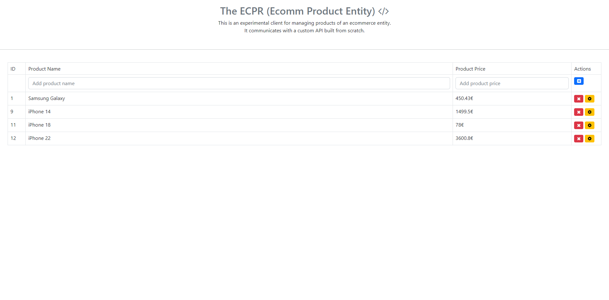
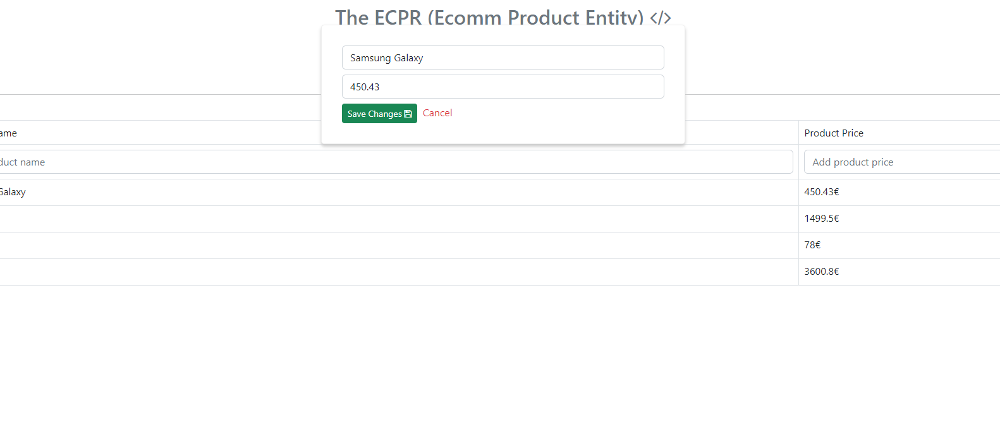

# The ECPR (Ecomm Product Entity)
This is an experimental client for managing products of an ecommerce entity.
It communicates with a custom API built from scratch with 
plain PHP 7 \w PDO and MySQL. The client was built using Vanilla JavaScript, AJAX and Bootstrap 5.

# Installation Details
- Install XAMPP
- Move all files to the `htdocs` folder
- Activate/Start `apache` and `mysql` services
- Navigate to `localhost/phpmyadmin`
- Create a database named `ecomm_entity`
- Run the `main.sql` script
- Navigate to `localhost`
- Start using the app

# Usage 
You may use the following endpoints using the API key: `6bef8098d5b6f35b8efd79d456303257acd89f05`;
- URL: `api/api.php?products=all` / Method: `GET` / returns `Array` with all products (can be used for pagination)
- URL: `api/api.php?id=3` / Method: `GET` / returns `Array` with a single product
- URL: `api/api.php?remid=3` / Method: `GET` / deletes a product given its id
- URL: `api/api.php` / Method: `POST` / Required body param: `upd` with value `upd-prod` / updates a product given some values (note that you need to pass the product id as well!)
- URL: `api/api.php` / Method: `POST` / Required body param: `inp` with value `in-prod` / 
inserts a new product given a set of values